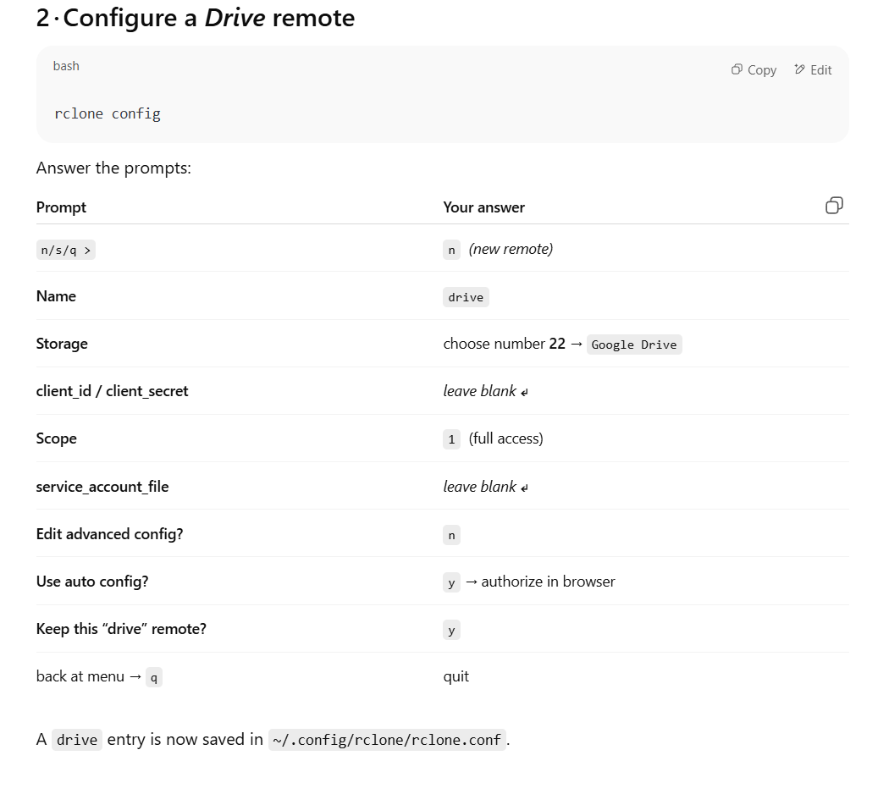

# Share & Retrieve a Large File with **rclone** + Google Drive  
<small>(no confirm‑token hassles)</small>

---

## 1 · Install **rclone** (first machine)

```bash
# Install unzip once (needed by the script)
sudo apt update && sudo apt install unzip -y

# Fetch and install rclone
curl https://rclone.org/install.sh | sudo bash

rclone config
```



```bash
rclone copy diffdock.tar.gz drive:/SharedFiles/ --progress

rclone link drive:/SharedFiles/diffdock.tar.gz
```

how to use it 

```bash 

set -e

echo "📦 Installing gdown..."
pip install -q gdown

echo "🔽 Downloading diffdock.tar.gz from Google Drive…"
gdown --id 14_Lce88Vb1hL4vuL4KHYlnNlcYA9hzf0 -O diffdock.tar.gz

```
